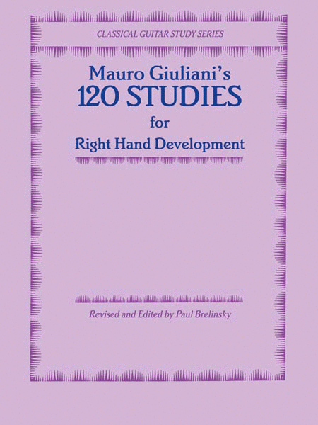

# Mauro Giuliani's 120 Studies For Right Hand Development
# 莫罗·朱利安尼的120首右手指法练习曲

#### Description
Use XunScore to encode scores from 《Mauro Giuliani's 120 Studies For Right Hand Development》

本书是根据现代伟大的吉他教育家、演奏家塞戈维亚在基吉亚纳音乐学院讲学中用的吉他教材选编的。是吉他练习中的精华部分。
本书不论是对于初学者还是已具备一定水平的演奏者，都是必不可少的练习条目。一些已享有盛名的吉他大师，如阿部保夫、桑杰士等人还仍然在坚持练习。但有些初学者却恰恰忽视了这一点，认为只要会弹了，就可以不必再练习了，往往使演奏技巧不能尽快地提高或者千脆半途而废。
练习中，首先应注意：对于以下的练习曲，不要单一地进行弹奏，而要结合其他的吉他教本，按程度进行配合，循序渐进地练习。虽然这些练习十分重要，但如果单纯的一条条弹下去，而不和教本中规定的曲目相同步地进行练习，则不容易收到明显的效果。
优秀的练习曲是为了优秀的演奏。何况后面的一些条目难度较大，不是短时间内能够奏效的。对于初学者来说，更应该避免长时间枯噪的练习。所以，既要持之以恒，又要有计划性。
其次，练习中一定要按照乐谱中规定的指法去弹奏。为了右手达到高水平的运用，曲中有些指法编排得难度很大，但这是前人经验的总结，对提高演奏水平有很大的作用，所以一定要按规定指法认真练习，不得随意更改。
学习吉他，基础一定要打好。当你的演奏技巧达到较高水平时，可逐渐形成自己的风格并加以创新。没有坚定的基础，不可能踏踏实实地前进。没有创新和多种多样的风格，则吉他的生命也就结束了。
第三点要注意的是，虽然反复地练习具有重大的意义，但只用一种勾上（ Alaire ）弹法（也有译为悬空弹法），效果不够全面；应该同时运用勾上弹法和平行（ Apoyando ）弹法（也有译靠弦弹法）进行练习。就是开头的低音用拇指以平行弹法弹出，别的手指用勾上弹法，随后的拇指则象圆滑奏那样不必将手指抬高再把以后的低音用勾上弹法弹出。（这当然是指在固定的拍节里有两个以上须要用拇指来弹奏的音。）
只要你不中断吉他的演奏，那么，这些练习将终生伴随着你，使你永远受益。只要勤加练习，相信你的进步将会与日俱增。
编者：王云 蒋晓苏 1987年冬于泉城济南

#### Instructions

1. Download XunScore. (http://www.xunscore.cn)
2. Use XunScore export zip files, place in the assets folder.

#### Contribution

- [Etude NO.1-10.xun](https://xunscore.github.io/GiulianiStudies/player.html?url=assets/Etude%20NO.1-10)
- [Etude NO.11-20.xun](https://xunscore.github.io/GiulianiStudies/player.html?url=assets/Etude%20NO.11-20)
- [Etude NO.21-30.xun](https://xunscore.github.io/GiulianiStudies/player.html?url=assets/Etude%20NO.21-30)
- [Etude NO.31-40.xun](https://xunscore.github.io/GiulianiStudies/player.html?url=assets/Etude%20NO.31-40)
- [Etude NO.41-50.xun](https://xunscore.github.io/GiulianiStudies/player.html?url=assets/Etude%20NO.41-50)
- [Etude NO.51-60.xun](https://xunscore.github.io/GiulianiStudies/player.html?url=assets/Etude%20NO.51-60)
- [Etude NO.61-70.xun](https://xunscore.github.io/GiulianiStudies/player.html?url=assets/Etude%20NO.61-70)
- [Etude NO.71-80.xun](https://xunscore.github.io/GiulianiStudies/player.html?url=assets/Etude%20NO.71-80)
- [Etude NO.81-90.xun](https://xunscore.github.io/GiulianiStudies/player.html?url=assets/Etude%20NO.81-90)
- [Etude NO.91-100.xun](https://xunscore.github.io/GiulianiStudies/player.html?url=assets/Etude%20NO.91-100)
- [Etude NO.101-110.xun](https://xunscore.github.io/GiulianiStudies/player.html?url=assets/Etude%20NO.101-110)      
- [Etude NO.111-120.xun](https://xunscore.github.io/GiulianiStudies/player.html?url=assets/Etude%20NO.111-120)
